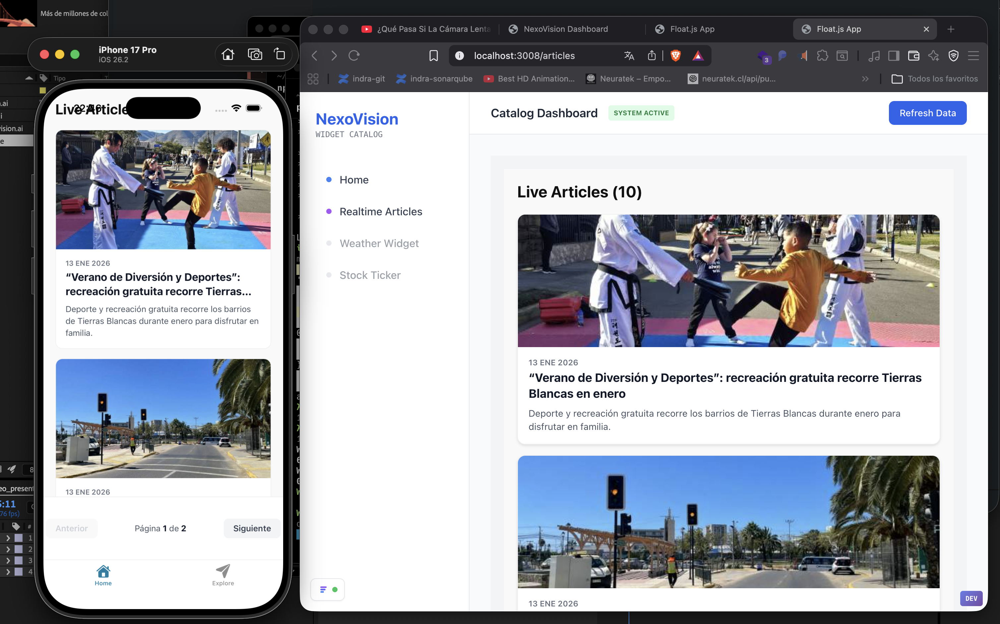

# Maravilla Digital CMS



**Version 1.0.0** | [maravilla.digital](https://maravilla.digital)

> A production-ready headless CMS for multi-platform widget distribution via MCP integration and real-time content delivery.

## 🌟 Overview

**Maravilla Digital** is a modern content management system designed to distribute widgets and real-time information across multiple platforms through WebSocket connections and MCP (Model Context Protocol) integration. Built with React Native as the single source of truth, it enables seamless content delivery to web applications, mobile apps, digital displays, and static websites.

### Key Features

- **🚀 Real-Time Distribution**: WebSocket-based push notifications for instant content updates
- **🎯 Multi-Platform Support**: Single codebase renders on web, iOS, Android, and digital displays
- **🔌 MCP Integration**: Model Context Protocol support for standardized content distribution
- **📦 Widget System**: Modular, reusable widgets with hot-reload capabilities
- **⚡ SSR & Static Generation**: Server-side rendering with Float.js framework
- **🗄️ Flexible Database**: SQLite by default, extensible architecture for other SQL databases
- **🎨 React Native First**: Write once, render everywhere philosophy

## 🏗️ Architecture

The project follows a monorepo architecture with clear separation of concerns:

```
maravilla-digital/
├── packages/
│   ├── cms-rt/                    # Core CMS with real-time capabilities
│   ├── ui-kit/                    # @maravilla/ui-kit - Component library
│   ├── ui-logic/                  # @maravilla/ui-logic - Business logic layer
│   ├── widgets-catalog/           # @maravilla/widgets-catalog - Widget registry
│   ├── widget-catalog-web/        # @maravilla/widget-catalog-web - Web display
│   ├── widget-catalog-mobile/     # Component showcase & demo (React Native)
│   └── framework/                 # Float.js framework (core & lite)
├── cms/                           # Keystatic CMS interface
└── dashboard/                     # Admin dashboard
```

### Technology Stack

- **Frontend**: React 19, React Native 0.81
- **Framework**: Float.js (SSR + Client-side)
- **Styling**: NativeWind (TailwindCSS for React Native)
- **Database**: SQLite (default), extensible for production SQL databases
- **Real-time**: Native WebSocket implementation
- **Package Manager**: pnpm 9
- **Build Tool**: esbuild + tsup
- **TypeScript**: Full type safety across the monorepo

## 📋 Prerequisites

Before you begin, ensure you have the following installed:

- **Node.js** 18.0.0 or higher ([Download](https://nodejs.org/))
- **pnpm** 9.0.0 or higher
  ```bash
  npm install -g pnpm@9
  ```
- **Git** ([Download](https://git-scm.com/))

### Optional (for mobile development):
- **Xcode** (macOS only, for iOS development)
- **Android Studio** (for Android development)
- **Expo CLI** (installed automatically)

## 🚀 Getting Started

### 1. Clone the Repository

```bash
git clone https://github.com/maravilla-digital/maravilla-cms.git
cd maravilla-cms
```

### 2. Install Dependencies

```bash
pnpm install
```

This will install all dependencies across the entire monorepo using pnpm workspaces.

### 3. Environment Configuration

Copy the example environment file and configure your settings:

```bash
cp packages/cms-rt/.env.example packages/cms-rt/.env
```

Edit `.env` with your configuration:

```env
# Database Configuration
DATABASE_TYPE=sqlite  # Default: sqlite (extensible to other SQL databases)
DATABASE_PATH=./cms.sqlite

# WebSocket Configuration
WS_PORT=3006
WS_HOST=localhost

# CMS Configuration
CMS_PORT=3005
CMS_HOST=localhost

# API Keys (for MCP integration)
MCP_API_KEY=your_api_key_here
```

### 4. Database Setup

Initialize the database and seed with sample data:

```bash
cd packages/cms-rt
pnpm seed
```

## 💻 Development

### Running the Full Stack

Start all services (CMS, widgets, and dashboard):

```bash
pnpm dev:all
```

This command will:
1. Clean up any running processes on required ports
2. Start the UI Kit dev server (port 3002)
3. Start the UI Logic dev server (port 3009)
4. Start the CMS with WebSocket server (port 3005, WebSocket on 3006)
5. Start the Web Widget Catalog (port 3008)
6. Start the Admin Dashboard (port 8000)
7. After 5 seconds, launch the mobile app (iOS Simulator)

### Running Individual Services

#### CMS Only
```bash
pnpm dev:cms
```
Access at: `http://localhost:3005`

#### Web Widget Catalog
```bash
pnpm dev:widgets-web
```
Access at: `http://localhost:3008`

#### Mobile Widget Catalog (iOS)
```bash
pnpm dev:widgets-mobile
```

#### Admin Dashboard
```bash
pnpm dev:dashboard
```
Access at: `http://localhost:8000`

#### Development Libraries
```bash
# UI Kit (hot-reload for components)
pnpm dev:ui-kit

# UI Logic (hot-reload for business logic)
pnpm dev:ui-logic
```

### Port Reference

| Service | Port | Description |
|---------|------|-------------|
| CMS Frontend | 3005 | Main CMS interface |
| WebSocket Server | 3006 | Real-time updates |
| Web Widgets | 3008 | Widget display (web) |
| UI Kit | 3002 | Component development |
| UI Logic | 3009 | Business logic development |
| Dashboard | 8000 | Admin dashboard |
| Mobile App | 8081 | Expo development server |

## 🏗️ Building for Production

### Build All Packages

```bash
pnpm build
```

### Build Specific Packages

```bash
# CMS only
pnpm build:cms

# Web widgets only
pnpm build:widgets
```

### Production Environment

For production deployment:

1. Update environment variables for production:
```env
DATABASE_TYPE=sqlite  # Or configure your preferred SQL database
DATABASE_PATH=./cms.sqlite
NODE_ENV=production
```

2. Build the project:
```bash
pnpm build
```

3. Start the production server:
```bash
cd packages/cms-rt
pnpm start
```

## 📦 Package Overview

### @maravilla/ui-kit

React Native component library with cross-platform support.

**Key Components:**
- `ArticleCard` - Article display card
- `FloatDate` - Formatted date display
- Custom styled primitives (View, Text, etc.)

**Usage:**
```typescript
import { ArticleCard } from '@maravilla/ui-kit';

<ArticleCard
  title="Article Title"
  excerpt="Article description..."
  coverImage="https://example.com/image.jpg"
  publishedAt="2024-01-15"
  onPress={() => console.log('Article clicked')}
/>
```

### @maravilla/ui-logic

Business logic layer for data fetching and state management.

**Key Exports:**
- `useArticles` - Fetch and manage articles
- `ArticleListContainer` - Pre-built article list component
- Data transformation utilities

**Usage:**
```typescript
import { useArticles } from '@maravilla/ui-logic';

function MyComponent() {
  const { articles, loading, error } = useArticles({ limit: 10 });
  
  if (loading) return <ActivityIndicator />;
  if (error) return <Text>Error: {error}</Text>;
  
  return <FlatList data={articles} ... />;
}
```

### maravilla-cms

Core CMS with real-time capabilities.

**Features:**
- Content management API
- WebSocket server for real-time updates
- SQLite database with extensible architecture
- MCP integration endpoints

**API Endpoints:**
- `GET /api/articles` - List all articles
- `POST /api/articles` - Create article
- `WS /api/realtime` - WebSocket connection

## 🔌 WebSocket Integration

### Client-Side Connection

```typescript
import { createRealtimeClient } from '@float.js/lite';

const client = createRealtimeClient({
  url: 'ws://localhost:3006/api/realtime',
  room: 'articles'
});

client.on('message', (data) => {
  console.log('Received update:', data);
  // Update your UI with new data
});

client.on('connect', () => {
  console.log('Connected to real-time server');
});

// Send a message
client.send({
  type: 'subscribe',
  topics: ['articles', 'breaking-news']
});
```

### Server-Side Broadcasting

```typescript
// In your API route
import { realtime } from '@float.js/core';

export const GET = realtime({
  rooms: ['articles', 'news'],
  onConnect: (client) => {
    client.send({ type: 'welcome', message: 'Connected!' });
  },
  onMessage: (client, message) => {
    // Broadcast to all clients in the room
    client.room?.broadcast(message);
  }
});
```

## 🗄️ Database

### Current Implementation

The project uses SQLite for development with a repository pattern that abstracts database access:

```typescript
// Example: Using the repository pattern
import { createDatabase } from './database';

const db = createDatabase({
  type: 'sqlite',
  path: './cms.sqlite'
});

const articles = await db.articles.findAll();
const article = await db.articles.findById('123');
```

### Database Extensibility

The project uses SQLite with an **extensible architecture** that allows migration to other SQL databases (like PostgreSQL, MySQL, etc.) through the repository pattern:

```typescript
// Current: SQLite
const db = createDatabase({
  type: 'sqlite',
  path: './cms.sqlite'
});

// Future: Can be extended to support other databases
const db = createDatabase({
  type: 'your-database',
  config: { /* database-specific config */ }
});
```

The repository pattern abstracts database operations, making the codebase database-agnostic and ready for production scaling.

## 🧪 Testing

```bash
# Run all tests
pnpm test

# Run tests in a specific package
pnpm --filter maravilla-cms test
```

## 📝 Code Quality

### Type Checking

```bash
pnpm typecheck:all
```

### Linting

```bash
pnpm lint
```

### Formatting

```bash
pnpm format
```

## 🛠️ Troubleshooting

### Port Already in Use

If you encounter port conflicts:

```bash
pnpm dev:cleanup
```

This will kill all processes on ports: 3002, 3005, 3006, 3008, 3009, 8000, 8081

### Module Not Found Errors

Ensure all dependencies are installed:

```bash
pnpm install
```

If issues persist, try cleaning and reinstalling:

```bash
pnpm clean
pnpm install
```

### WebSocket Connection Failures

1. Verify the WebSocket server is running (port 3006)
2. Check firewall settings
3. Ensure correct WebSocket URL in client configuration

## 📚 Additional Documentation

- [Framework Documentation](./packages/framework/README.md)
- [API Reference](./packages/cms-rt/docs/API.md)
- [Widget Development Guide](./packages/widgets-catalog/README.md)
- [Deployment Guide](./docs/DEPLOYMENT.md)

## 🤝 Contributing

We welcome contributions! Please see our [Contributing Guidelines](./CONTRIBUTING.md) for details.

### Development Workflow

1. Fork the repository
2. Create a feature branch (`git checkout -b feature/amazing-feature`)
3. Commit your changes (`git commit -m 'Add amazing feature'`)
4. Push to the branch (`git push origin feature/amazing-feature`)
5. Open a Pull Request

## 📄 License

This project is licensed under the MIT License - see the [LICENSE](./LICENSE) file for details.

## 🙏 Acknowledgments

- Built with [Float.js](https://github.com/float-js/float.js) framework
- Powered by [React Native](https://reactnative.dev/)
- UI styling with [NativeWind](https://www.nativewind.dev/)

## 💬 Support

- Website: [maravilla.digital](https://maravilla.digital)
- Issues: [GitHub Issues](https://github.com/maravilla-digital/maravilla-cms/issues)
- Email: support@maravilla.digital

---

**Made with ❤️ by the Maravilla Digital Team**
